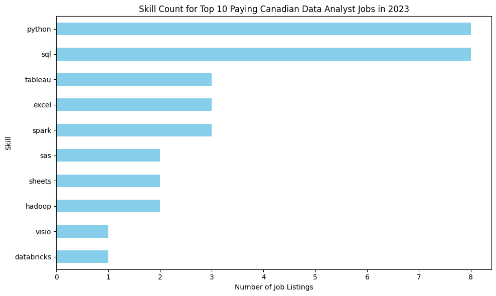

# Introduction

I completed the course SQL for Data Analytics by Luke Barousse (https://youtu.be/7mz73uXD9DA) to upgrade my SQL skills. 


# Background
The data I used contained information on thousands of job postings in data-related roles. This was obtained from the SQL for Data Analytics Course by course by Luke Barousse (https://drive.google.com/drive/folders/1moeWYoUtUklJO6NJdWo9OV8zWjRn0rjN)

To understand more about the data analytcs job market in Canada, such as the top-paying jobs, most in-demand skills,  I used this data to conduct various relevant queries.


The main questions governing this analysis were:

- What data analyst jobs are the highest paying?
- What skills are required for top-paying jobs?
- What skills are in highest demand for data analysts?
- Which skills lead to higher salaries?
- What are the optimal skills to learn?


# Tools I used
* SQL: For accessing job data within a database and easy query writing.
* PostgreSQL: Used as the server.
* Visual Studio Code: Used to conviently write code in a comprehensive environment.
* GitHub: To display project for others to see.


# The Analysis
Each of the 5 queries was aimed at answering a different question relating to the data analytics job market in Canada. Below I give a description of how each question is answered. 


**1. 10 Highest Paid Data Analyst Jobs in Canada**

I sorted data analyst jobs by salary and specified Canada as the location. The query below shows how I did this.

```sql
-- Jobs in Canada

SELECT
    job_id,
    job_title_short,
    job_title,
    job_location,
    job_schedule_type,
    salary_year_avg,
    job_posted_date,
    name AS company_name
FROM
    job_postings_fact
LEFT JOIN company_dim ON job_postings_fact.company_id = company_dim.company_id

WHERE
    job_title_short = 'Data Analyst' 
    AND job_location LIKE '%Canada%' 
    AND salary_year_avg IS NOT NULL
ORDER BY
    salary_year_avg DESC   
Limit 10
```


Here is a summary of the results from the above query:
- The salary range is rather narrow for the top 10 data analyst jobs, ranging from $100,500 CAD to $111,175 CAD.
- The employers offering these jobs are large financial services companies, such as Stripe, Sunlife and ATB Financial.
- There is variation in job titles, ranging from Data Analyst, Analytics Engineering Lead and Analytics Lab Architect, showing a range of specializations and roles.
  


**2. Skills Needed in Canada's Top-Paying Data Analyst Jobs**

To learn more about the ideal skillset for a Canadian Data Analyst, I joined the job postings with the skills data to reveal which skills are correlated with higher salaries.

```sql
WITH top_paying_jobs AS (
    SELECT
        job_id,
        job_title,
        salary_year_avg,
        name AS company_name
    FROM
        job_postings_fact
    LEFT JOIN company_dim ON job_postings_fact.company_id = company_dim.company_id

    WHERE
        job_title_short = 'Data Analyst' AND 
        job_location LIKE '%Canada%' AND
        salary_year_avg IS NOT NULL
    ORDER BY
        salary_year_avg DESC    
    Limit 10
)

SELECT 
    top_paying_jobs.*,
    skills
FROM top_paying_jobs
INNER JOIN skills_job_dim ON top_paying_jobs.job_id = skills_job_dim.job_id
INNER JOIN skills_dim ON skills_job_dim.skill_id = skills_dim.skill_id
ORDER BY
    salary_year_avg DESC
```




**3. Most Desired Skills for Canadian Data Analysts**
This query shows how often different skills come up in data analyst postings in Canada.

```sql
SELECT
    skills,
    COUNT(skills_job_dim.job_id) AS demand_count
FROM job_postings_fact
INNER JOIN skills_job_dim ON job_postings_fact.job_id = skills_job_dim.job_id
INNER JOIN skills_dim ON skills_job_dim.skill_id = skills_dim.skill_id
WHERE
    job_title_short = 'Data Analyst' AND 
    job_location LIKE '%Canada%'
GROUP BY
    skills
ORDER BY
    demand_count DESC
LIMIT 5

```

Here's the summary of the most demanded skills for data analysts in Canada in 2023

- SQL and Excel are the most prominent, highlighting the need for fundamental skills in data processing and spreadsheet manipulation.
- Python, Tableau and Power BI are essential for analyzing and visualizing data for story telling and decision support.

| Skill     | Demand Count |
|-----------|---------------|
| SQL       | 963           |
| Excel     | 625           |
| Python    | 588           |
| Tableau   | 454           |
| Power BI  | 417           |

*Table of the demand for the top 5 skills in Canadian data analyst job postings*


**4. Data Analyst Skills Ranked By Salary in Canada**
Here I explore the average salary per skill, to understand which skills will yield the greatest income.


```

SELECT
    skills,
    ROUND(AVG(salary_year_avg),0) AS avg_salary
FROM job_postings_fact
INNER JOIN skills_job_dim ON job_postings_fact.job_id = skills_job_dim.job_id
INNER JOIN skills_dim ON skills_job_dim.skill_id = skills_dim.skill_id
WHERE
    job_title_short = 'Data Analyst' 
    AND salary_year_avg IS NOT NULL
    AND job_location LIKE '%Canada%'
GROUP BY
    skills
ORDER BY
    avg_salary DESC 
LIMIT 10


```
Here's a summary of the results of the top paying skills for data analysts in Canada:

- Programming & Scripting Languages: TypeScript and JavaScript top the list, highlighting the demand for analysts who can automate tasks, build interactive dashboards, or work closely with web-based data tools.

- Big Data & Cloud Tools: Spark, Hadoop, BigQuery, and Databricks show that expertise in handling large-scale data, cloud platforms, and distributed computing is highly valued.

- Productivity & Visualization Tools: Sheets, Jira, Looker, and Visio indicate that strong skills in reporting, collaboration, and data visualization/diagramming remain critical for translating insights into business decisions.


| Skill       | Average Salary (CAD) |
|-------------|----------------------|
| TypeScript  | 108,416              |
| Spark       | 107,479              |
| Hadoop      | 107,167              |
| JavaScript  | 101,750              |
| BigQuery    | 101,750              |
| Databricks  | 101,014              |
| Sheets      | 100,625              |
| Jira        | 100,500              |
| Looker      | 100,500              |
| Visio       | 100,500              |

*Table of the average salary for the top 10 paying skills for Canadian Data Analysts*


**5. Most Important Skills to Learn for Canadian Data Analyst Jobs**
This query extracts both the skills that are in the highest demand and highest paying for data analyst jobs in Canada


```sql
SELECT
    skills_dim.skill_id,
    skills_dim.skills,
    COUNT(skills_job_dim.job_id) AS demand_count,
    ROUND(AVG(job_postings_fact.salary_year_avg),0) AS avg_salary
FROM job_postings_fact
INNER JOIN skills_job_dim ON job_postings_fact.job_id = skills_job_dim.job_id
INNER JOIN skills_dim ON skills_job_dim.skill_id = skills_dim.skill_id
WHERE
    job_title_short = 'Data Analyst'
    AND salary_year_avg IS NOT NULL
    AND job_location LIKE '%Canada%'
GROUP BY
    skills_dim.skill_id
HAVING
    COUNT(skills_job_dim.job_id) > 5
ORDER BY
    avg_salary DESC,
    demand_count DESC
LIMIT 25;
```

| Skill ID | Skill   | Demand Count | Average Salary (CAD) |
|----------|---------|--------------|--------------------|
| 182      | Tableau | 9            | 92,572             |
| 1        | Python  | 14           | 92,494             |
| 0        | SQL     | 16           | 89,285             |
| 181      | Excel   | 9            | 83,563             |

*Table of the most optimal skills for a Canadian data analyst sorted by salary*

# What I Learned
Over the duration of this project, I have mastered the basics of SQL by performing the following actions:
* **Advanced SQL Queries:** I handled advanced SQL methods such as merging tables, writing CTEs and joining tables to make data readily available in a single table.
* **Data Aggregation:** Utilized the GROUP BY method in concert with aggregate functions such as AVG() and COUNT() to summarize data to obtain descriptive statistics.
* **Analytical Insights** I increased my problem solving skills by using SQL queries to produce visually informative and insightful tables to answer a variety of analytical questions.


# Conclusion
I have learned some major insights about the Canadian job market for data analysts in 2023:


